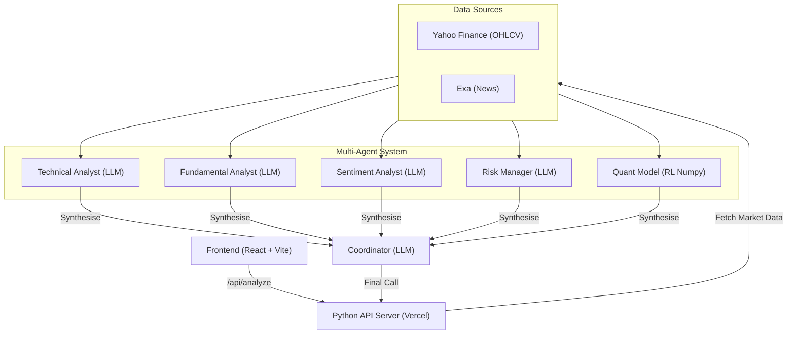

<div align="center">
  <h1>Nexus — Multi-Agent Trading Analyst</h1>
  <p><strong>A production-ready trading system orchestrating 4 LLMs and a PPO Reinforcement Learning Quant Model to synthesise final market decisions.</strong></p>

  [](https://github.com/bhavuk1409/multi-agent-trading-analyst/actions/workflows/ci.yml)
  [](https://www.python.org/)
  [](https://react.dev/)
  [](https://groq.com/)
  [](https://stable-baselines3.readthedocs.io/)
  [](https://opensource.org/licenses/MIT)

  <h3><a href="https://nexus-multi-agent-trading-analyst.vercel.app">🔴 Live Demo App</a></h3>
</div>

<hr/>

## Table of Contents
- [Overview](#overview)
- [What's New in v2](#whats-new-in-v2)
- [System Architecture](#system-architecture)
- [Agent Weights & Rules](#agent-weights--rules)
- [Data Sources & Indicators](#data-sources--indicators)
- [Quick Start](#quick-start)
- [RL Agent Training](#rl-agent-training)
- [Project Structure](#project-structure)
- [Contributing](#contributing)

---

## Overview

**Nexus** is an advanced AI-driven multi-agent system. Five specialised models analyse real market data in parallel and synthesise a final trading recommendation with an entry price, stop-loss, take-profit, and position size:

1. **Technical Analyst (LLM)**
2. **Fundamental Analyst (LLM)**
3. **Sentiment Analyst (LLM)**
4. **Risk Manager (LLM)**
5. **Quant Model (PPO RL)**

## What's New in v2

The original four-agent LLM system has been extended with a **fifth agent: the Quant Model**, a PPO reinforcement-learning policy trained on 4+ years of historical OHLCV data.

| Feature | v1 (Legacy) | v2 (Current) |
|---|---|---|
| **Agents** | 4 × LLM | 4 × LLM + 1 × RL policy |
| **RL Inference** | — | Pure numpy (<1 ms, no torch at runtime) |
| **Coordinator** | Equal 0.25 weights | Tuned fractional weights |
| **Deployment Footprint** | ~15 MB | ~15 MB (RL adds 0 MB — relies entirely on NumPy) |

> **Key Design Decision:** The RL policy weights are exported to a lightweight 21 KB `.npz` file (`models/rl_policy_weights.npz`). Inference uses a pure-numpy forward pass, meaning `torch` and `stable-baselines3` are **not imported at runtime**, keeping the Vercel serverless bundle extremely lean.

---

## System Architecture



---

## Agent Weights & Rules

| Agent | Type | Weight | Notes |
|---|---|---|---|
| Technical Analyst | LLM (LLaMA 3.3 70B) | **0.20** | RSI, MACD, Bollinger, SMA crossovers |
| Fundamental Analyst | LLM (LLaMA 3.3 70B) | **0.225** | P/E, EPS, sector, analyst targets |
| Sentiment Analyst | LLM (LLaMA 3.3 70B) | **0.225** | News, social signals |
| Risk Manager | LLM (LLaMA 3.3 70B) | **0.20** | HV-14, ATR, drawdown, position sizing |
| **Quant Model** | **PPO RL (numpy)** | **0.15** | Defensive/risk-hedging |

> **Risk Profile:** Backtesting showed the RL model is stronger at avoiding sustained downtrends (avoiding -31% TSLA and -26% MSFT drawdowns in out-of-sample testing), but trailed slightly during major bull rallies. Thus, it acts as a **defensive 0.15 weighted hedge** rather than a primary momentum signal.

---

## Data Sources & Indicators

| Data Required | Source | API key |
|---|---|---|
| Price history (OHLCV) & Quotes | Yahoo Finance (`yfinance`) | No — free |
| Fundamentals | Yahoo Finance (`.info`) | No — free |
| News (primary) | Exa Neural Search | Optional |
| News (fallback) | Yahoo Finance headlines | No — free |
| LLM reasoning | Groq (LLaMA 3.3 70B) | Yes — required |
| RL training data | Yahoo Finance OHLCV | No — free |

*(System utilises RSI-14, MACD, SMA-20/50, Bollinger Bands, HV-14, ATR-14, and max drawdowns for technical signals).*

---

## Quick Start

### 1. Prerequisites
- Python 3.10+
- Node.js 18+
- A free [Groq API key](https://console.groq.com)
- (Optional) An [Exa API key](https://exa.ai)

### 2. Installation
```bash
# Clone the repository
git clone https://github.com/bhavuk1409/multi-agent-trading-analyst.git
cd multi-agent-trading-analyst

# Setup environment variables
cp .env.example .env
# Edit .env to add your GROQ_API_KEY

# Setup Python Backend
python3 -m venv .venv
source .venv/bin/activate          # Windows: .venv\Scripts\activate
pip install -r requirements.txt

# Setup React Frontend
cd frontend && npm install && cd ..
```

### 3. Running Locally
Run both backend and frontend via the automated start script:
```bash
./start.sh
```
Then navigate to **[http://localhost:5174](http://localhost:5174)**.

---

## RL Agent Training

The Quant Model ships pre-trained. If you want to retrain from scratch (e.g., adding tickers or modifying hyperparameters):

1. **Install Training Dependencies:**
   ```bash
   pip install -r requirements-training.txt
   ```
   *(Training dependencies like `stable-baselines3`, `torch`, and `gymnasium` are kept strictly separated from production deployments).*

2. **Run Training:**
   ```bash
   python scripts/train_rl_agent.py
   ```
3. **Export Weights for Inference:**
   ```bash
   python scripts/export_rl_weights.py
   ```
4. **Validate Policy with Backtesting:**
   ```bash
   python scripts/window_backtest.py
   ```

---

## Project Structure

```text
├── api_server.py              # Local Python HTTP API server
├── api/                       # Vercel serverless entry point
├── config/                    # Tickers, LLM model/params, agent weights
├── src/
│   ├── data_handler.py        # yfinance + Exa fetching, indicators, fundamentals
│   ├── multi_agent_system.py  # 5-agent pipeline + Coordinator
│   ├── rl_env.py              # Gymnasium TradingEnv (training environment)
│   ├── rl_features.py         # Shared Gym-free observation engineering
│   └── rl_agent.py            # Pure-numpy RL inference wrapper (no torch)
├── models/                    # Exported 21KB Numpy policy weights
├── scripts/                   # PPO training, exporting, and backtesting
├── tests/                     # 47 Unit & Integration tests
└── frontend/                  # React + Vite UI
```

---

## Contributing

We welcome contributions! Please see our [Contributing Guidelines](CONTRIBUTING.md) for details on how to submit pull requests, report issues, and improve the codebase. 

---

## License

This project is licensed under the [MIT License](LICENSE).
